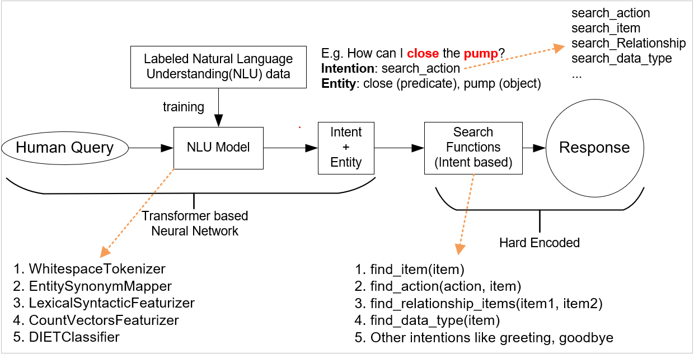

# Festo_Assistant
<p align="center">
  
</p>

An AI Assistant based on rasa to answer to questions, for example:

- Does the workstation have a valve/pump?
- What action may I use to open/close the valve/pump?
- Is the valve/pump related to Pipe1/Pipe2?
- What is the data type of the input data for the valve/pump?

This repository contains data and code files for an AI assistant (trained by rasa) which can answer some human questions based on the "W3C_WoT_Thing_Description" document.

Rasa Open Source is a conversational AI framework for building contextual assistants.

## About this repository 

To use the repository, clone it to your local machine:

```https://github.com/Haoyu-R/Festo_Assistant.git```

After that, navigate to the directory.

## Which Rasa version should I use?

The code in this repository is compatible with latest release of Rasa. 

To install Rasa run (requires Python 3.6.0 or higher):
 
```pip3 install rasa``` **!!!It's highly recommend to use venv to avoid conflicts!!!**

All the dependecy will be checked and installed automatically
## Pipeline

<p align="center">
  
</p>

The main function of the framework is **main.py** and the trained model is in **models/nlu**.

* Training data

To train a rasa NLU, we need to label the sentences with intent and entities. For more information please refer to [here](https://rasa.com/docs/rasa/nlu/training-data-format/#training-data-format).
The training data for this repo can be found in data/nlu.md 

* Model structure
```
  - name: WhitespaceTokenizer        // Use empty/whitespaces as a separator to tokenize sentence
  - name: RegexFeaturizer            // Extract centain format of msg using regular expression. e.g. zip code
  - name: EntitySynonymMapper        // Map different words with same meaning to same value. e.g. singular and plurals
  - name: LexicalSyntacticFeaturizer // Extract lexical and syntactic features of input to for entity understanding
  - name: CountVectorsFeaturizer     // Make bag of words representation of input
  - name: CountVectorsFeaturizer
    analyzer: "char_wb"              // charactre n-grams
    min_ngram: 1
    max_ngram: 4
  - name: DIETClassifier // Intent and entity classification
    epochs: 100 
  - name: ResponseSelector // not used here
```

* Output of neural network

Here is an example of output when user type msg: **I want to turn on the valve**:
```
 - {
    "intent": {
        "name": "search_action",
        "confidence": 0.9996362924575806
    },
    "entities": [
        {
            "entity": "do",
            "start": 10,
            "end": 17,
            "value": "turn on",
            "extractor": "DIETClassifier"
        },
        {
            "entity": "item",
            "start": 18,
            "end": 23,
            "value": "valve",
            "extractor": "DIETClassifier"
        }
    ],
    "intent_ranking": [
        {
            "name": "search_action",
            "confidence": 0.9996362924575806
        },
        {
            "name": "relationship_item",
            "confidence": 0.0002463638666085899
        },
        {
            "name": "thank",
            "confidence": 7.103376265149564e-05
        },
        {
            "name": "goodbye",
            "confidence": 4.230353079037741e-05
        },
        {
            "name": "search_data_type:",
            "confidence": 1.937867409651517e-06
        },
        {
            "name": "greet",
            "confidence": 1.0874940699068247e-06
        },
        {
            "name": "search_item",
            "confidence": 9.800797897696611e-07
        }
    ],
    "response_selector": {
        "default": {
            "response": {
                "name": null,
                "confidence": 0.0
            },
            "ranking": [],
            "full_retrieval_intent": null
        }
    },
    "text": "i want to turn on valve"
}
```


* Answer search

Based on the intent and entity classification from neural network, we can call different functions in the **functions.py** to search certain places in the document. And the questions are categorized into four groups:

1. Ask about certain component in the document
```find_item(item_name)```
2. Ask about certain action in the document
```find_action(action_name)```
3. Ask relationship between component
```find_relationship_items(item1, item2)```
4. Ask data type of the component
```find_data_type(item)```


## Test
* Test on some questions out of scope
```
* please help with my ice cream it's dripping
* no wait go back i want a dripping ice cream but a cone that catches it so you can drink the ice cream later
* i want a non dripping ice cream
* someone call the police i think the bot died
* show me a picture of a chicken
* neither
* I want french cuisine
* i am hungry
* restaurant
* can i be shown a gluten free restaurant
* i don't care!!!!
* i do not care how are you
* again?
* oh wait i gave you my work email address can i change it?
* hang on let me find it
* stop it, i do not care!!!
* how come?
* I changed my mind
* what?
* did i break you
* that link doesn't work!
* you already have that
* this is a really frustrating experience
* no stop
* give me food
* i want food
* Can I ask you questions first?
* is it a wasteland full of broken robot parts?
* can we keep chatting?
* talk to me
* who is your favourite robot?
* can you help me to build a bot

 - Sorry, I didn't understand your question. You may try to rephrase the question
```

* Test on different variantions of target questions with the same meaning, we get the same answer
```
* does the workstation have a valve
* is there a valve in the workstation
* is there a valve
* does a valve exist
* does the workstation have valves
* are there valves in the workstation
* do valves exist

Yes, there is a valve
		

* what action may I use to open the valve
* how can I open the valve
* what action may I use to turn on the valve
* how can I turn on the valve
* how to open the valve
* how to turn on the valve

You should take action OpenValve with type of iot:TurnOn

* is the valve associated with pipe1
* is the valve related to pipe1
* does the valve be used in pipe1
* whether the valve is used in pipe1
* is the pipe1 associated with valve
* is the pipe1 related to valve
* does pipe1 has a valve

Yes

* what is the data type of the input data for the valve
* what is the type of the valve input data
* show me the data type of the valve
* find me the data type of valve
* I need the data type of valve
* Can you tell me the data type of valve
* data type of valve

It's boolean

* does the workstation have a pump
* is there a pump in the workstation
* is there a pump
* does a pump exist
* does the workstation have pumps
* are there pumps in the workstation
* do pumps exist

Yes, there is a pump

* what action may I use to open the pump
* how can I open the pump
* what action may I use to turn on the pump
* how can I turn on the pump
* how to open the pump
* how to turn on the pump

You should take action StartPump with type of iot:TurnOn

* is the pump associated with pipe2
* is the pump related to pipe2
* does the pump be used in pipe2
* whether the pump is used in pipe2
* is the pipe2 associated with pump
* is the pipe2 related to pump
* does pipe2 has a pump

Yes

* what is the data type of the input data for the pump
* what is the type of the pump input data
* show me the data type of the pump
* find me the data type of pump
* I need the data type of pump
* Can you tell me the data type of pump
* data type of pump

It's boolean

* what action may I use to close the valve
* how can I close the valve
* what action may I use to turn off the valve
* how can I turn off the valve
* how to close the valve
* how to turn off the valve

You should take action CloseValve with type of iot:TurnOff

* what action may I use to close the pump
* how can I close the pump
* what action may I use to turn off the pump
* how can I turn off the pump
* how to close the pump
* how to turn off the pump

You should take action StopPump with type of iot:TurnOff
```
